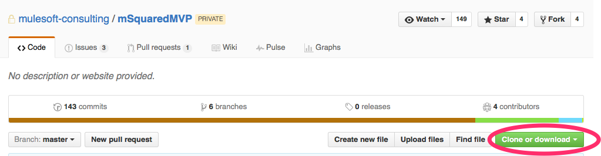
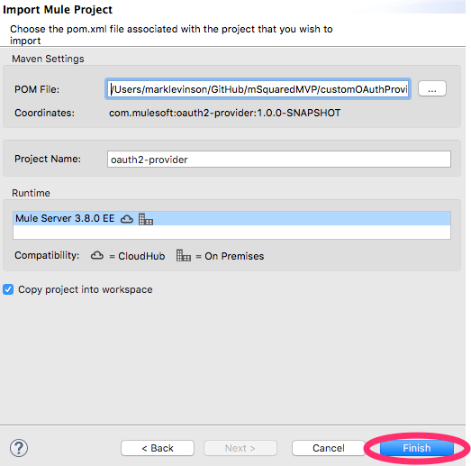

include::../common/commonTemplates/standardM2Header.adoc[]

:numbered:

== Installation and Configuration
::
Used the following Software for this MVP:

* AnyPoint Studio 6.0 with Mule Runtime 3.8
* Java JDK 1.8
* PostMan
* Maven 3.3.9 (Ensure Mule EE Repository is setup with credentials)

=== Download the project from github
:: Download or Clone the repository from GitHub to your local device.

:: 

=== Import into AnyPoint Studio 6.0
::
Open AnyPoint Studio

* Use File->Import in Studio:
image:images/importPOM.png[Import POM, 650]::
* Select the POM.xml in the project and click finish
:: 
* You should see maven run all of it's dependencies:

NOTE: It is still important to limit logging as much as possible for all the usual reasons.
